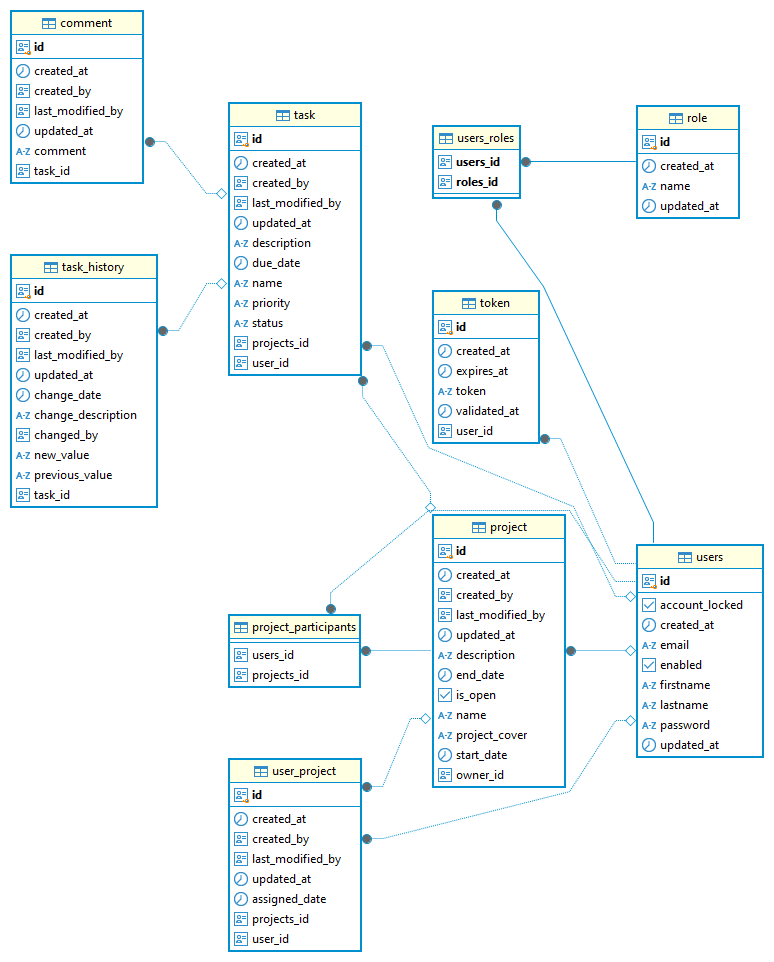

# Task Tracker

A task tracker helps admins, managers, and users organize, prioritize, assign, and track tasks in real-time. It features notifications, status updates, and collaboration tools to ensure deadlines are met and workloads are managed efficiently.

- **Admins**: Have full control over all tasks and user management.
- **Managers**: Can create, assign, and monitor tasks and projects within their teams.
- **Users**: Can view and comment their assigned tasks.



**Note:** The service is running on a free tier on render.com, so performance may be limited. You can access it here: [Task Tracker Service](https://task-tracker-w7g0.onrender.com/projects)

## Table of Contents

- [Features](#features)
- [Technologies](#technologies)
- [Getting Started](#getting-started)
  - [Prerequisites](#prerequisites)
  - [Installation and Running the application](#installation-and-running-the-application)
- [Usage](#usage)
- [API Documentation](#api-documentation)
- [Contact](#contact)

## Features

- Task Management: Easily create, assign, and prioritize tasks with deadlines and status updates.
- Progress Tracking: Monitor the status of tasks in real-time, ensuring deadlines are met and projects stay on schedule.
- Collaboration: Share tasks and updates with team members, enabling seamless communication and coordination.

## Technologies

- **Core Frontend Technologies:** React, React Router, React Hook Form, Axios, Yup
- **UI & Styling:** MUI (Material UI), Emotion (CSS-in-JS), Normalize.css
- **Date Management:** date-fns
- **Development Tools:** TypeScript, Vite, ESLint, Prettier, Nodemon
- **Containerization:** Docker
- **Backend:** Spring Boot, Spring Data JPA, Spring Security, Spring Validation, Thymeleaf, Spring Mail, JWT (JSON Web Token), OpenAPI, Mockito, JUnit
- **Database:** PostgreSQL
- **Others:** dotenv (for environment variables), Lombok, Maven

## Getting Started

### Prerequisites

List the software and tools required to run the application.

```bash
- Docker  (for backend development)
- Node.js (for frontend development)
```


### Installation and Running the application

1. Clone the repository:

    ```bash
    git clone https://github.com/sunk4/task-tracker
    ```

2. Build and run the backend services using Docker Compose:

    ```bash
    docker-compose up --build
    ```

   > **To stop the backend**, press `Ctrl+C` in the terminal, or run the following in another terminal:
   ```bash
   docker-compose down
   ```

3. Open a new terminal for the frontend, and navigate to the frontend directory:
   ```bash
   cd frontend
   ```

4. Install the frontend dependencies:
   ```bash
   npm install
   ```
5. Generate api:
   ```bash
   npm run generate-api
   ```
6. Run the frontend application:
   ```bash
   npm run dev
   ```

### Usage

Once the backend and frontend are running, follow these steps to use the application:

1. **Access the application**:
   - Open your browser and navigate to `http://localhost:5174` to access the frontend of the application.

2. **Backend API**:
   - The backend API is running at `http://localhost:8088`. You can interact with it via tools like Postman or Curl.
   - Example: If it's a REST API, you can try an endpoint like:
     ```bash
     curl http://localhost:8088/api/v1/tasks
     ```
   - This will return a list of tasks (or other data, depending on your app).

3. **Using PostgreSQL**:
   - The PostgreSQL database is running in a container at `localhost:54320`.
   - You can connect to it using a PostgreSQL client or via CLI using:
     ```bash
     psql -h localhost -p 54320 -U root -d task_tracker
     ```

## API Documentation

You can access the API documentation using the following links:

- [Swagger UI](http://localhost:8088/api/v1/swagger-ui/index.html)
- [OpenAPI JSON](http://localhost:8088/api/v1/v3/api-docs)

## Contact

If you have any questions or feedback, feel free to reach out:

- **Email:** trnka.roman.careers@gmail.com
- **LinkedIn:** [Roman Trnka](https://www.linkedin.com/in/roman-trnka-938666169/)
- **GitHub:** [sunk4](https://github.com/sunk4/task-tracker)

            
